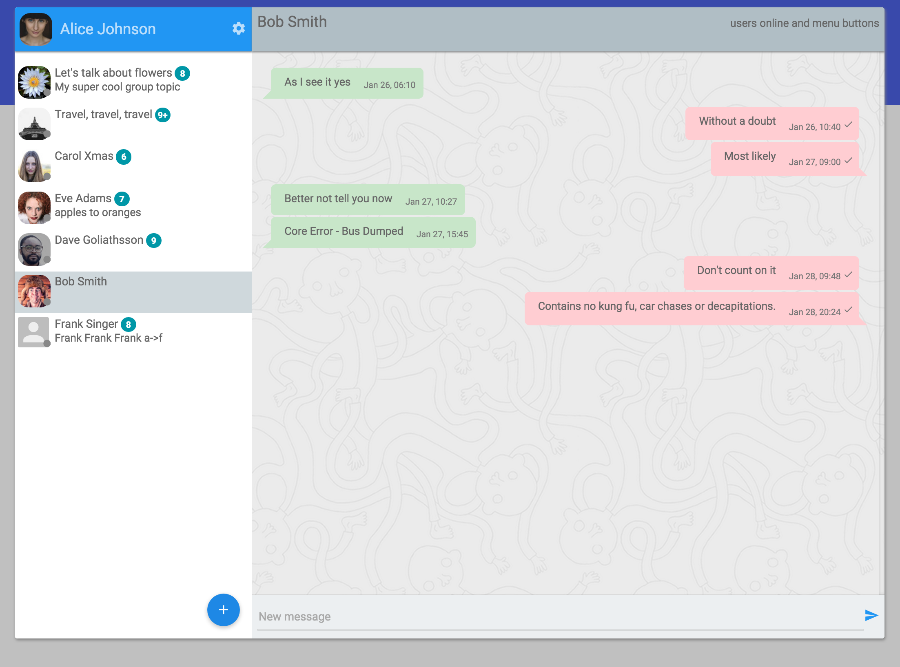

# Single-page chat with Tinode

Example using [Tinode](https://github.com/tinode/chat/) to build a single-page chat application. The app uses
[React](https://facebook.github.io/react/), Google's material design [fonts](https://www.google.com/fonts/)
and [icons](https://google.github.io/material-design-icons/#icon-font-for-the-web). The [Tinode javascript library](https://github.com/tinode/tinode-js/) has no external dependencies.

This is work in progress. Bugs are expected. The app was tested in the latest Chrome & Firefox only.

Try it at http://api.tinode.co/x/example-react-js/. Login as one of `alice`, `bob`, `carol`, `dave`, `frank`.
Password is `<login>123`, e.g. login for `alice` is `alice123`.

License: [Apache 2.0](http://www.apache.org/licenses/LICENSE-2.0)

Photos from https://www.pexels.com/ under [CC0 license](https://www.pexels.com/photo-license/).

Background pattern from http://subtlepatterns.com/, commercial and non-commercial use allowed with attribution.

