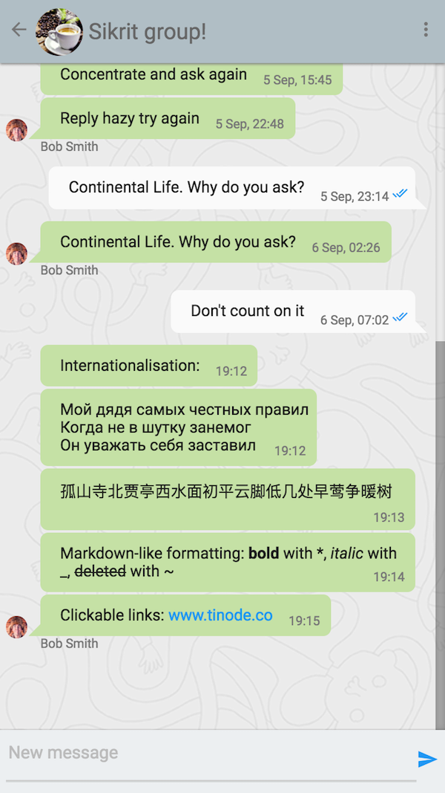
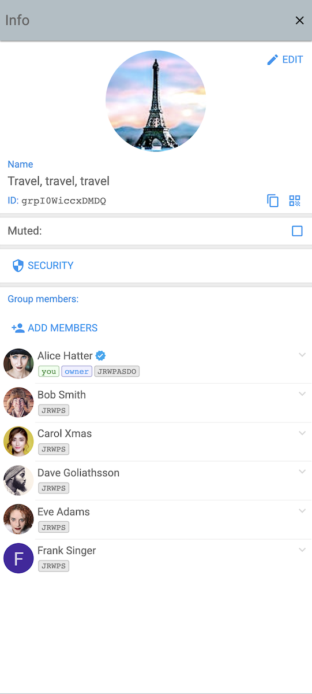
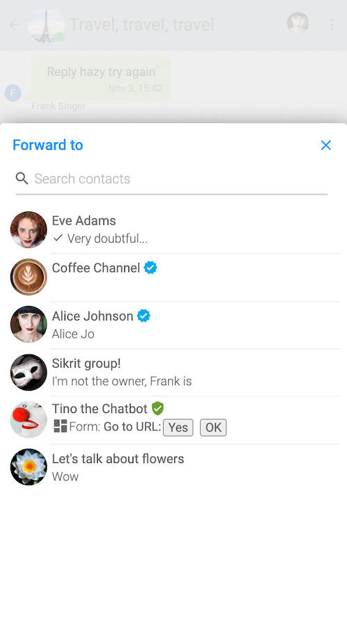
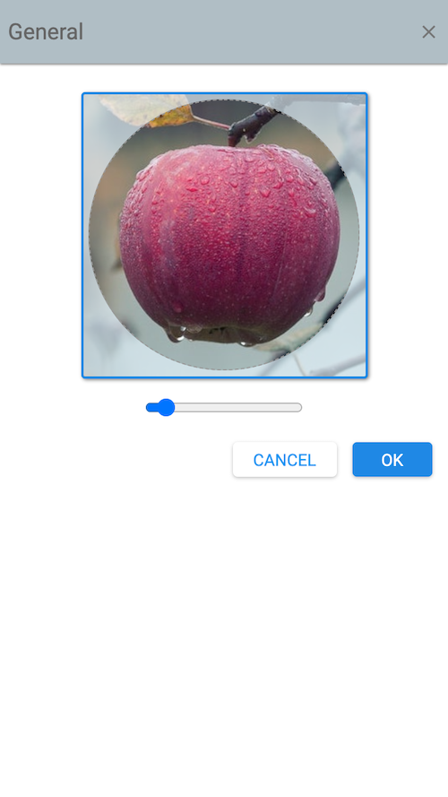

# Tinode Web

## Briefing

Single-page web chat application for [Tinode](https://github.com/tinode/chat/). The app is built on
[React](https://reactjs.org/). The [Tinode javascript SDK](https://github.com/tinode/tinode-js/) has no external dependencies.
Overall, it's a lot like open source WhatsApp or Telegram web apps.

Although the app is generally usable, keep in mind that this is work in progress. Some bugs probably exist, some features are missing. The app was tested in the latest Chrome & Firefox only. NPM package is [available](https://www.npmjs.com/package/tinode-webapp).

Try possibly newer or older version live at https://sandbox.tinode.co/.

For demo access and other instructions [see here](https://github.com/tinode/chat/#demosandbox).

## Installing and running

This is _NOT_ a standalone app, this is just a frontend, a client. It requires a [backend](https://github.com/tinode/chat/). See [installation instructions](https://github.com/tinode/chat/blob/master/INSTALL.md). See instructions for [enabling push notifications](push.md).

## Getting support

* Read [client-side](http://tinode.github.io/js-api/) and [server-side](https://github.com/tinode/chat/blob/master/docs/API.md) API documentation.
* For support, general questions, discussions post to [https://groups.google.com/d/forum/tinode](https://groups.google.com/d/forum/tinode).
* For bugs and feature requests [open an issue](https://github.com/tinode/webchat/issues/new).
* Use https://tinode.co/contact for commercial inquiries.

## Helping out

* If you appreciate our work, please help spread the word! Sharing on Reddit, HN, and other communities helps more than you think.
* Consider buying paid support: https://tinode.co/support.html
* If you are a software developer, send us your pull requests with bug fixes and new features.
* If you use the app and discover bugs or missing features, let us know by filing bug reports and feature requests. Vote for existing [feature requests](https://github.com/tinode/chat/issues?q=is%3Aissue+is%3Aopen+sort%3Areactions-%2B1-desc+label%3A%22feature+request%22) you find most valuable.
* If you speak a language other than English, [translate](https://github.com/tinode/chat/blob/devel/docs/translations.md#webapp) the apps into your language. You may also review and improve existing translations.
* If you are a UI/UX expert, help us polish the app UI.
* Use it: install it for your colleagues or friends at work or at home.

## Internationalization

The app is fully internationalized using [React-Intl](https://github.com/formatjs/react-intl). The UI language is selected automatically from the language specified by the browser. A specific language can be forced by adding `#?hl=XX` parameter to the URL when starting the app, e.g. https://web.tinode.co/#?hl=fr.

The app is currently available in the following languages:
 * English - default
 * Arabic
 * Chinese simplified
 * Chinese traditional
 * French
 * German
 * Italian
 * Korean
 * Romanian
 * Russian
 * Spanish
 * Thai
 * Ukrainian

More translations are welcome. See [instructions](https://github.com/tinode/chat/blob/devel/docs/translations.md#webapp).

## Not done yet

* End-to-End encryption.
* Emoji support is weak.
* Mentions, hashtags.
* Previews not generated for links and docs.
* Location and contact sharing.
* Recording video messages.

## Other

* Demo avatars and some other graphics are from https://www.pexels.com/ under [CC0 license](https://www.pexels.com/photo-license/).
* Background patterns from http://subtlepatterns.com/, commercial and non-commercial use allowed with attribution.
* [Fonts](https://fonts.google.com/) and [icons](https://google.github.io/material-design-icons/#icon-font-for-the-web) from Google under [license](https://developers.google.com/terms) which permits commercial and non-commercial use.
* Push notifications built with https://firebase.google.com/.

## Responsive design

### Desktop screenshot

  

### Mobile screenshots

  <kbd></kbd> <kbd></kbd> <kbd></kbd> <kbd></kbd> <kbd></kbd> <kbd></kbd>

