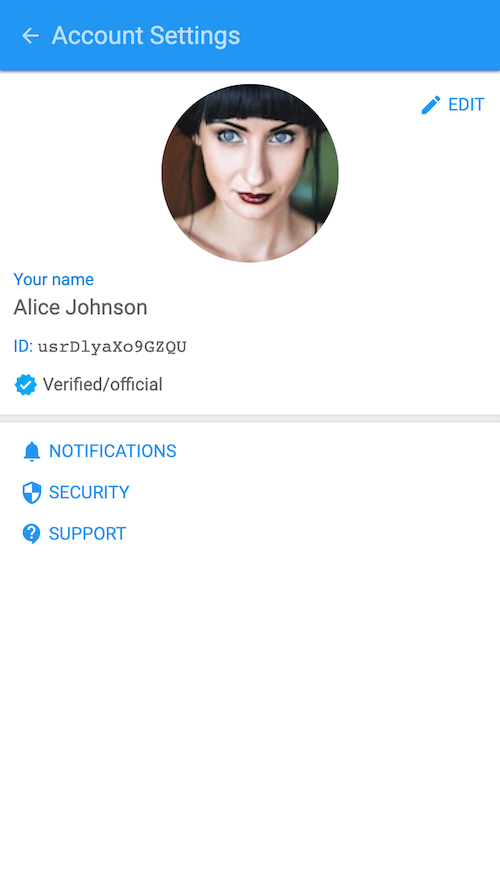

# Tinode Web

## Briefing

Single-page web chat application for [Tinode](https://github.com/tinode/chat/). The app is built on
[React](https://reactjs.org/). The [Tinode javascript SDK](https://github.com/tinode/tinode-js/) has no external dependencies.
Overall, it's a lot like open source WhatsApp or Telegram web apps.

Although the app is generally usable, keep in mind that this is work in progress. Some bugs probably exist, some features are missing. The app was tested in the latest Chrome & Firefox only. NPM package is [available](https://www.npmjs.com/package/tinode-webapp).

Try possibly newer or older version live at https://web.tinode.co/.

For demo access and other instructions [see here](https://github.com/tinode/chat/#demosandbox).

## Installing and running

This is NOT a standalone app, this is just a frontend, a client. It requires a [backend](https://github.com/tinode/chat/). See [installation instructions](https://github.com/tinode/chat/blob/master/INSTALL.md).

## Getting support

* Read [client-side](http://tinode.github.io/js-api/) and [server-side](https://github.com/tinode/chat/blob/master/docs/API.md) API documentation.
* For support, general questions, discussions post to [https://groups.google.com/d/forum/tinode](https://groups.google.com/d/forum/tinode).
* For bugs and feature requests [open an issue](https://github.com/tinode/webchat/issues/new).

## Internationalization

The app is fully internationalized using [React-Intl](https://github.com/formatjs/react-intl). The UI language is selected automatically from the language specified by the browser. A specific language can be forced by adding `#?hl=XX` parameter to the URL when starting the app, e.g. https://web.tinode.co/#?hl=ru.

As of the time of this writing the following translations exist:
 * English
 * Chinese (simplified)
 * German
 * Korean
 * Romanian
 * Russian
 * Spanish

More translations are welcome. Send a pull request with a json file with translated strings. Take a look at [English](/src/i18n/en.json), [Russian](/src/i18n/ru.json), or [Simplified Chinese](/src/i18n/zh.json) translations for guidance.

## Not done yet

* End-to-End encryption.
* Emoji support is weak.
* Mentions, hashtags.
* Replying or forwarding messages.
* Previews not generated for videos, audio, links or docs.

## Other

* Demo avatars and some other graphics are from https://www.pexels.com/ under [CC0 license](https://www.pexels.com/photo-license/).
* Background patterns from http://subtlepatterns.com/, commercial and non-commercial use allowed with attribution.
* [Fonts](https://fonts.google.com/) and [icons](https://google.github.io/material-design-icons/#icon-font-for-the-web) from Google under [license](https://developers.google.com/terms) which permits commercial and non-commercial use.
* Push notifications built with https://firebase.google.com/.

## Push notifications

If you want to use the app with your own server and want web push notification to work you have to set them up:

* Register at https://firebase.google.com/, set up the project if you have not done so already.
* Follow instructions to create a web application https://support.google.com/firebase/answer/9326094 in your project.
* Follow instructions at https://support.google.com/firebase/answer/7015592 to get a Firebase configuration object ("Firebase SDK snippet").
* Locate `firebase-init.js` in the root folder of your copy of TinodeWeb app. Copy-paste the following keys from the configuration object to `firebase-init.js`: `apiKey`, `messagingSenderId`, `projectId`, `appId` (you may copy all keys).
* Copy `Web Push certificate` (Project Settings -> Cloud Messaging -> Web configuration -> Web Push certificates) to `messagingVapidKey` field in `firebase-init.js`.
* Double check that `firebase-init.js` contains the following keys: `apiKey`, `messagingSenderId`, `projectId`, `appId`, `messagingVapidKey`. The file may contain other optional keys.
* Copy Google-provided server key to `tinode.conf`, see details [here](https://github.com/tinode/chat/blob/master/docs/faq.md#q-how-to-setup-fcm-push-notifications).

## Responsive design

### Desktop screenshot

  

### Mobile screenshots

      

